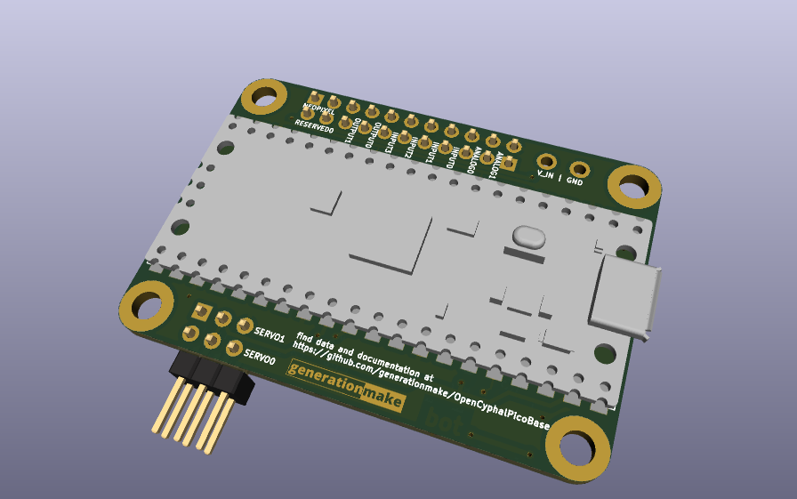
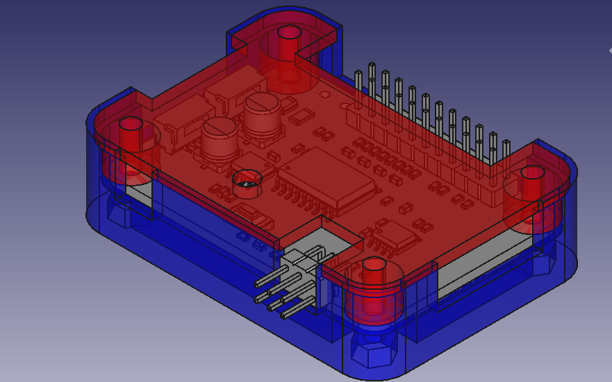
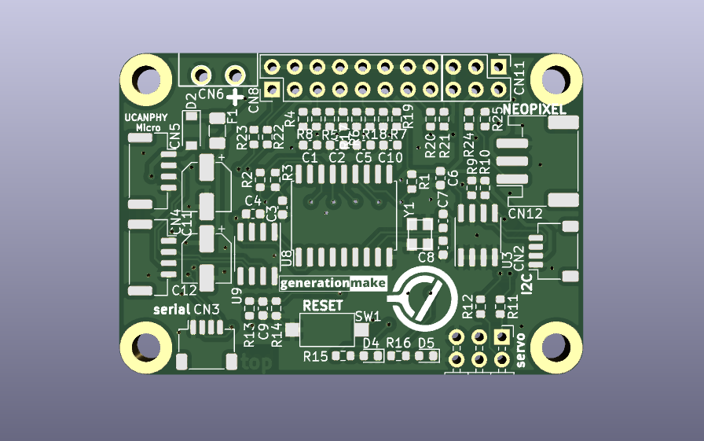
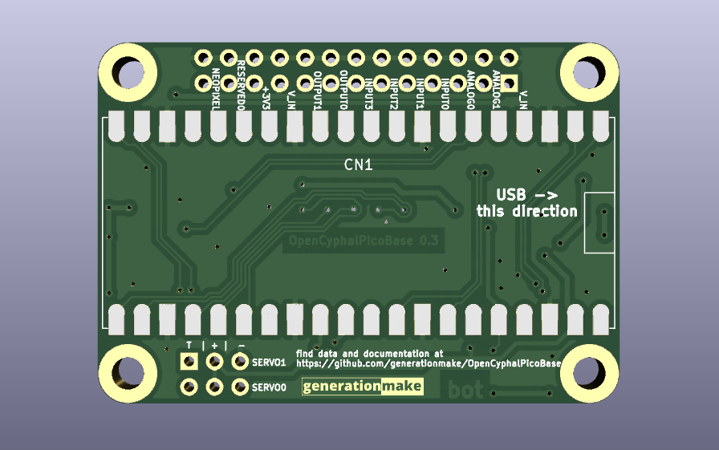

OpenCyphalPicoBase
==================
Board for the Raspberry Pi Pico to connect via CAN using OpenCyphal and UCANPHY Micro

  

  

## Description

The OpenCyphalPicoBase provides the following functions:
* CAN connectivity to a OpenCyphal CAN bus using a Microchip MCP2515 CAN controller ([datasheet](https://ww1.microchip.com/downloads/en/DeviceDoc/MCP2515-Stand-Alone-CAN-Controller-with-SPI-20001801J.pdf))
* Onboard I2C EEPROM to store settings
* measurement of CAN bus voltage using GP26
* onboard temperature measurement using the internal temperature sensor of the Raspberry Pi Pico
* two status LEDs (D4 and D5)
* Raspberry Pi Pico directly mounted on bottom layer
* connectors to several external functions (see list below)

## Firmware
* [OpenCyphalPicoBase-firmware](https://github.com/107-systems/OpenCyphalPicoBase-firmware): This is the default firmware for this board. It enables all basic functions

## Pin Usage

### Raspberry Pi Pico (CN1)

| **Pin** | **Pin Name** | **Signal**    | **Description**                  |
|:-------:|:------------:|:-------------:|:--------------------------------:|
| 1       | GP0          | UART0_TX      | reserved for future use (GNSS)   |
| 2       | GP1          | UART0_RX      | reserved for future use (GNSS)   |
| 3       | GND          | GND           |                                  |
| 4       | GP2          |               |                                  |
| 5       | GP3          |               |                                  |
| 6       | GP4          | I2C0_SDA      | for eeprom and qwiic connector   |
| 7       | GP5          | I2C0_SCL      | for eeprom and qwiic connector   |
| 8       | GND          | GND           |                                  |
| 9       | GP6          | GPI0          | input 0                          |
| 10      | GP7          | GPI1          | input 1                          |
| 11      | GP8          | GPI2          | input 2                          |
| 12      | GP9          | GPI3          | input 3                          |
| 13      | GND          | GND           |                                  |
| 14      | GP10         | GPO0          | output 0                         |
| 15      | GP11         | GPO1          | output 1                         |
| 16      | GP12         | reserved      | Neopixel                         |
| 17      | GP13         | reserved      | radiation detector               |
| 18      | GND          | GND           |                                  |
| 19      | GP14         | SERVO0        | servo 0                          |
| 20      | GP15         | SERVO1        | servo 1                          |
| 21      | GP16         | SPI_MISO      | SPI for MCP2515                  |
| 22      | GP17         | MCP2515_CS    | SPI for MCP2515                  |
| 23      | GND          | GND           |                                  |
| 24      | GP18         | SPI_CLK       | SPI for MCP2515                  |
| 25      | GP19         | SPI_MOSI      | SPI for MCP2515                  |
| 26      | GP20         | MCP2515_INT   | interrupt for MCP2515            |
| 27      | GP21         | STATUS_LED2   | internal status LED 2            |
| 28      | GND          | GND           |                                  |
| 29      | GP22         | STATUS_LED3   | internal status LED 3            |
| 30      | RUN          | RESET         | Reset for Board                  |
| 31      | GP26         | INPUT_VOLTAGE | measure input voltage            |
| 32      | GP27         | ANALOG_INPUT0 | analog input                     |
| 33      | GND          | GND           |                                  |
| 34      | GP28         | ANALOG_INPUT1 | analog input                     |
| 35      | ADC_VREF     |               |                                  |
| 36      | 3V3 (OUT)    | 3V3-rail      | supply voltage for board         |
| 37      | 3V3_EN       |               |                                  |
| 38      | GND          | GND           |                                  |
| 39      | VSYS         |               |                                  |
| 40      | VBUS         | 5V-rail       | supply voltage for board         |

## Pinout

### I2C (CN2)

compatible to the Sparkfun qwiic standard (https://www.sparkfun.com/qwiic). JST SH 1mm 4-pin.

| pin number | signal        |
|:----------:|:-------------:|
| 1          | GND           |
| 2          | +3V3          |
| 3          | I2C_SDA       |
| 4          | I2C_SCL       |

### serial (CN3)

JST SH 1mm 4-pin.

| pin number | signal        |
|:----------:|:-------------:|
| 1          | GND           |
| 2          | +3V3          |
| 3          | SER_TX        |
| 4          | SER_RX        |

### CAN (CN4 and CN5)

UCANPHY Micro connector, according to the UCANPHY_Specification (https://forum.opencyphal.org/t/cyphal-can-physical-layer-specification-v1-0/1471). JST GH 1.25mm 4-pin.

| pin number | signal        |
|:----------:|:-------------:|
| 1          | +5V           |
| 2          | CANH          |
| 3          | CANL          |
| 4          | GND           |

### power input (CN6)

3.81 mm screw terminal 2-pin.

| pin number | signal        |
|:----------:|:-------------:|
| 1          | +5V           |
| 2          | GND           |

This connector feeds power to the servo connector (CN7) and the neopixel connector (CN12) if power supply over the CAN connector is not sufficicant.

### servo connector (CN7)

This is a regular 0.1-inch pin header.

Standard RC servos can be directly plugged into this connector

| pin number | signal        |
|:----------:|:-------------:|
| 1          | servo0        |
| 2          | servo1        |
| 3          | +5V           |
| 4          | +5V           |
| 5          | GND           |
| 6          | GND           |

### input/output connector (CN8)

This is a regular 0.1-inch pin header.

| pin number | signal        |
|:----------:|:-------------:|
| 1          | ANALOG_INPUT1 |
| 2          | GND           |
| 3          | ANALOG_INPUT0 |
| 4          | GND           |
| 5          | INPUT0        |
| 6          | GND           |
| 7          | INPUT1        |
| 8          | GND           |
| 9          | INPUT2        |
| 10         | GND           |
| 11         | INPUT3        |
| 12         | GND           |
| 13         | OUTPUT0       |
| 14         | GND           |
| 15         | OUTPUT1       |
| 16         | GND           |

### additional connector (CN11)

This is a regular 0.1-inch pin header. 

Standard RC servos can be directly plugged into this connector

| pin number | signal        |
|:----------:|:-------------:|
| 1          | neopixel      |
| 2          | reserved      |
| 3          | +5V           |
| 4          | +3V3          |
| 5          | GND           |
| 6          | GND           |

### neopixel connector (CN12)

connector for Adafruit Neopixel RGB leds (https://learn.adafruit.com/adafruit-neopixel-uberguide/the-magic-of-neopixels). JST PH 2mm 3-pin.

| pin number | signal        |
|:----------:|:-------------:|
| 1          | neopixel      |
| 2          | +5V           |
| 3          | GND           |

## enclosure

There exists a 3D printable enclosure to encapsulate the PCB.

## PCB
### Top

  

### Bottom

  

